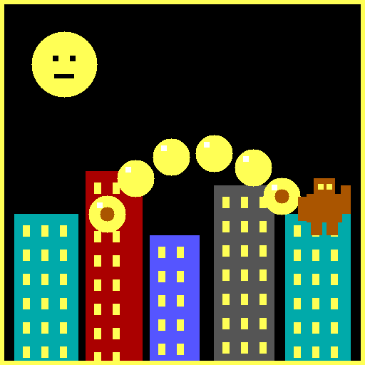

# 🍌 Banana Battle

A retro, DOS-style **artillery duel** for two players — inspired by the classic
QBasic *Gorillas* game, but built entirely from scratch with original code and
artwork. Lob bananas across a destructible skyline and try to knock out your
opponent.

It runs in the browser (built for **iPhone Safari**, works on desktop too) and
can be saved to your iPhone **Home Screen** as a full-screen web app.

## How to play

1. **Player 1** sets an **Angle** and **Power** with the sliders.
2. Watch the **Wind** (arrow at the bottom) — it pushes the banana sideways.
3. Tap **THROW**.
4. The banana flies in an arc. It can smash a chunk out of a building, sail off
   the screen, or hit the other gorilla.
5. Hit the opponent and you **win the round**. Otherwise it's the other
   player's turn.
6. Tap **NEW ROUND** for a fresh skyline. Scores are saved automatically.

Turn your phone **sideways** for a wider, roomier view — the layout switches to
put the game on the left and the controls on the right.

## Play it on your iPhone (GitHub Pages)

This repo is a plain static site (HTML/CSS/JS, no build step), so GitHub Pages
can serve it directly.

1. Push these files to GitHub (they're at the repository root).
2. In the repo, go to **Settings → Pages**.
3. Under **Build and deployment → Source**, choose **Deploy from a branch**.
4. Pick the branch that has this code and the **`/ (root)`** folder, then
   **Save**.
   - Easiest: merge this branch into **`main`** and serve from `main` / root.
   - Or serve directly from the `claude/gorillas-iphone-game-05iuyn` branch.
5. Wait a minute, then open the URL GitHub gives you (looks like
   `https://<your-username>.github.io/banana-battle/`) in **Safari** on your
   iPhone.
6. Tap the **Share** button → **Add to Home Screen** to install it as a
   full-screen app with its own icon.

## Files

| File | Purpose |
|------|---------|
| `index.html`  | Page markup, canvas, and touch controls |
| `styles.css`  | Pixel-crisp scaling, portrait + landscape layouts |
| `game.js`     | Game loop, physics, destructible terrain, rendering |
| `manifest.json` | PWA manifest for "Add to Home Screen" |
| `icon.png`    | 512×512 app / Home Screen icon |

## Technical notes

- Fixed **640 × 350** virtual canvas (VGA-ish), scaled to fit any screen while
  preserving the aspect ratio, with `image-rendering: pixelated` for the crisp
  retro look.
- Buildings are painted onto an **offscreen terrain canvas**. Explosions carve
  holes with `globalCompositeOperation = "destination-out"`, and collision is
  done by sampling that canvas's alpha — so destruction is truly destructible.
- Simple frame-based **ballistic physics** with gravity and wind, sub-stepped so
  fast bananas can't tunnel through thin buildings.
- No external assets or libraries — everything is generated in code.

## Credit

Original game concept popularized by *Gorillas* (Microsoft QBasic, 1991). This
is an independent, from-scratch recreation and does not use any of the original
code, assets, or trademarked material.
