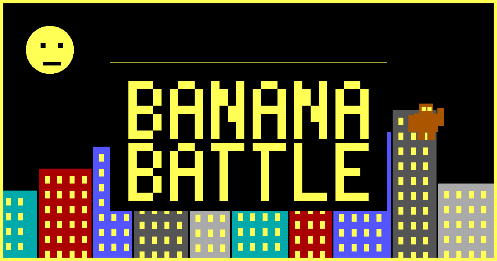
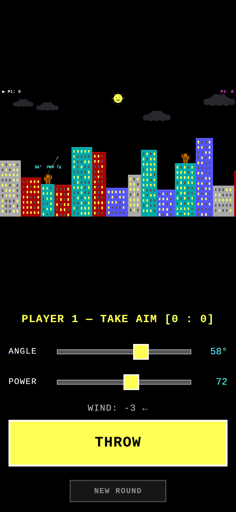
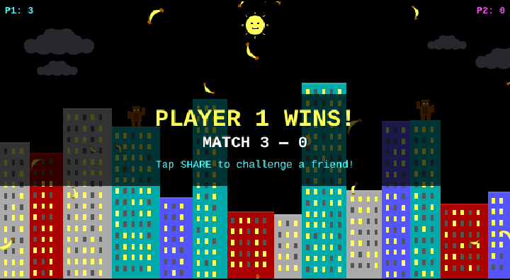
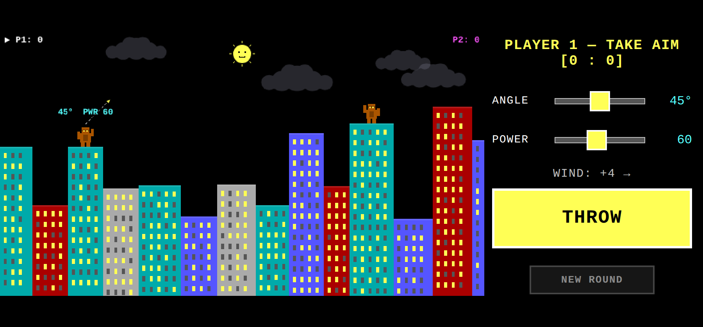

# 🍌 Banana Battle

### A retro artillery duel — lob bananas across a destructible city skyline and knock your rival off the rooftops.

**Two players. One phone. Total banana warfare.**

### ▶️ **[PLAY NOW → michael480th.github.io/Banana-Battle](https://michael480th.github.io/Banana-Battle/)**

`Free` &nbsp;·&nbsp; `No install` &nbsp;·&nbsp; `No accounts` &nbsp;·&nbsp; `Works on iPhone & desktop`

---

## 🎮 What is it?

Banana Battle is a love letter to the classic DOS/QBasic **Gorillas** game — rebuilt from scratch for your phone. Take turns hurling exploding bananas over a randomly generated pixel skyline, blasting craters through skyscrapers until someone lands a direct hit. Mind the **wind**. Best of the buildings you can carve a tunnel through. First to **3 wins** takes the match.

It runs entirely in your browser, plays great on **iPhone Safari**, and installs to your **Home Screen** like a real app — all from a single static page with no downloads, no sign-ups, and no ads.

&nbsp;&nbsp;

Aim with the sliders (or arrow keys), watch the wind, and blast through the city. Win the match and challenge a friend.

  

Turn your phone sideways for a widescreen battlefield.

---

## ✨ Features

- 🍌 **Ballistic banana warfare** — angle + power + wind, with a live on-screen aim arrow so every shot is a real decision.
- 🏙️ **Fully destructible skyline** — explosions carve real holes; chew a tunnel clean through a tower to reach your rival.
- 🌬️ **Wind you can *see*** — faint clouds drift across the sky at the speed and direction of the wind.
- 🏆 **Match play** — first to 3 round wins, ending on a confetti-soaked victory screen.
- 📲 **One-tap sharing** — brag your win straight to a friend via the native share sheet; they get a personalized "beat my score" challenge link.
- 🕹️ **Plays your way** — touch sliders on mobile, or **← → angle · ↑ ↓ power · Space to throw** on a keyboard.
- 📱 **Add to Home Screen** — installs as a full-screen web app with its own icon.
- 🎨 **Pure retro** — 640×350 virtual canvas, crisp pixel rendering, DOS-style 16-color palette. No libraries, no assets — every pixel is drawn in code.

---

## 🕹️ How to play

1. **Player 1** sets an **angle** and **power** — with the sliders, or the **arrow keys** on a laptop.
2. Check the **wind** — the clouds and the arrow show which way (and how hard) your banana will drift.
3. **THROW** (or press **Space**).
4. The banana arcs across the city. It can smash a crater in a building, sail off-screen, or nail the other gorilla.
5. A direct hit **wins the round**; otherwise it's your opponent's turn.
6. First player to **3 rounds** wins the **match** — then **share your victory** and challenge a friend. 🍌

> **Tip:** Each player's aim is remembered separately, so you can fine-tune from your last shot instead of re-dialing every turn.

---

## 📲 Add it to your iPhone Home Screen

1. Open **[the game](https://michael480th.github.io/Banana-Battle/)** in **Safari**.
2. Tap the **Share** button → **Add to Home Screen**.
3. Launch it from your Home Screen — it opens full-screen with its own banana icon, just like a native app.

---

## 🛠️ Built with

Plain **HTML + CSS + JavaScript** on the **Canvas API** — no frameworks, no build step, no dependencies. The whole game is one static page you can host anywhere.

A few technical highlights

 

- **Fixed 640×350 virtual canvas** (VGA-ish), scaled to any screen while preserving aspect ratio, with `image-rendering: pixelated` for the crisp retro look.
- **Truly destructible terrain** — buildings are painted to an offscreen canvas; explosions erase pixels with `globalCompositeOperation = "destination-out"`, and collision is done by sampling that canvas's alpha, so holes are real geometry you can fly through.
- **Frame-based ballistic physics** with gravity and wind, sub-stepped so fast bananas can't tunnel through thin buildings.
- **Web Share API** for native mobile sharing, with a clipboard fallback on desktop, plus Open Graph tags for rich link previews.
- **Progressive Web App** manifest + icon for Home Screen install.

| File | Purpose |
|------|---------|
| `index.html` | Page markup, canvas, touch controls, meta tags |
| `styles.css` | Pixel-crisp scaling, portrait + landscape layouts |
| `game.js` | Game loop, physics, destructible terrain, rendering, sharing |
| `manifest.json` | PWA manifest for Add to Home Screen |
| `icon.png` / `og-image.png` | App icon and social share image |

---

## 📜 Credit

Inspired by *Gorillas* (Microsoft QBasic, 1991). Banana Battle is an independent, from-scratch recreation with original code and artwork — it uses none of the original game's code, assets, title, or trademarked material.

**[🍌 Play Banana Battle →](https://michael480th.github.io/Banana-Battle/)**

